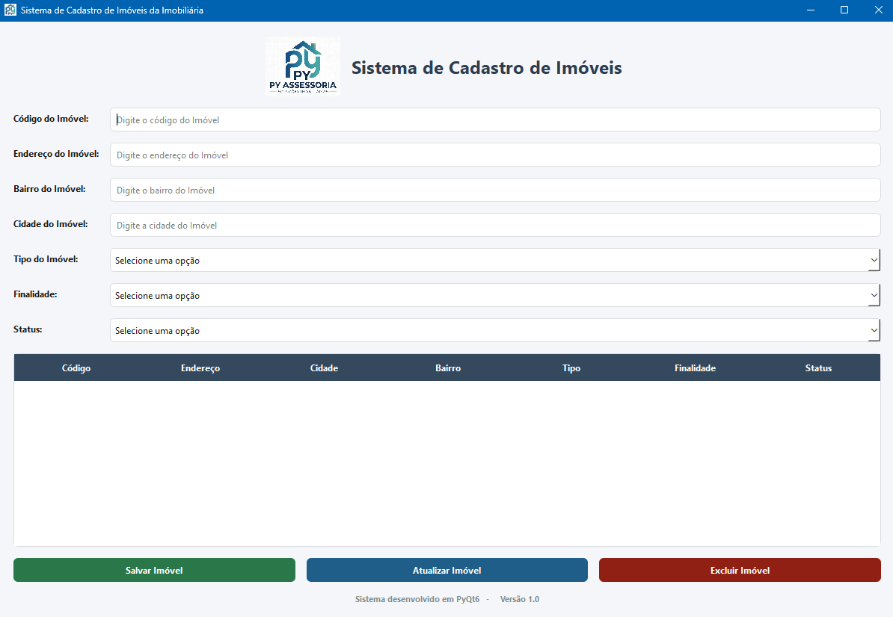

# 🏢 Py Assessoria - Imobiliária PyQt

Sistema de Cadastro de Imóveis desenvolvido com **Python** e **PyQt6** para fins acadêmicos e de aprendizado prático durante o estudo de caso da disciplina interface gráfica em python na Pós-Graduação Lato Sensu em Desenvolvimento de Sistemas Python da UNICESUMAR.

---

## 📸 Demonstração



---

## 🎯 Objetivo do Projeto

Este projeto foi criado com o objetivo de praticar conceitos fundamentais de desenvolvimento desktop utilizando Python e PyQt6, aplicando boas práticas de organização, versionamento e construção de interfaces gráficas.

Durante o desenvolvimento foram trabalhados conceitos como:

- Programação Orientada a Objetos (POO)
- Desenvolvimento de interfaces gráficas com PyQt6
- Organização de projetos Python
- Eventos e sinais (Signals & Slots)
- Manipulação de tabelas
- Validação de formulários
- Estilização com QSS
- Controle de versão com Git
- Publicação e gerenciamento de código com GitHub

---

## ⚙️ Funcionalidades

### Cadastro de Imóveis

- Cadastro de imóveis
- Código do imóvel
- Endereço
- Bairro
- Cidade
- Tipo do imóvel

### Controle Comercial

- Venda
- Locação
- Venda e Locação

### Controle de Status

- Disponível
- Locado
- Vendido
- A Liberar

### Gerenciamento

- Inclusão de imóveis
- Atualização de imóveis
- Exclusão de imóveis
- Seleção de imóveis pela tabela
- Limpeza automática do formulário
- Validação de campos obrigatórios

---

## 🖥️ Interface

A aplicação possui:

- Cabeçalho com logotipo
- Formulário organizado
- Tabela de imóveis
- Botões de ação
- Rodapé informativo
- Tema visual desenvolvido com QSS

---

## 🛠️ Tecnologias Utilizadas

- Python 3
- PyQt6
- Qt Designer Concepts
- QSS (Qt Style Sheets)
- Git
- GitHub

---

## 📂 Estrutura do Projeto

```text
Imobiliaria_PyQT/
│
├── assets/
│   ├── icons/
│   └── images/
│
├── styles/
│   └── styles.qss
│
├── windows/
│   ├── __init__.py
│   └── WindowMain.py
│
├── main.py
├── README.md
└── .gitignore
```

---

## 🚀 Como Executar

### Clonar o projeto

```bash
git clone https://github.com/MaiconDante/Imobiliaria_PyQT.git
```

### Acessar a pasta

```bash
cd Imobiliaria_PyQT
```

### Instalar dependências

```bash
pip install -r requirements.txt
```

### Executar

```bash
python main.py
```

---

## 📚 Aprendizados

Este projeto foi desenvolvido como prática para consolidação dos estudos de PyQt6 e servirá como base para futuras evoluções, incluindo:

- Persistência em SQLite
- Arquitetura MVC
- Múltiplas janelas
- Relatórios
- Pesquisa e filtros
- Deploy da aplicação

---

## 👨‍💻 Autor

Maicon Dante

Projeto desenvolvido para fins acadêmicos e de aprendizado contínuo em Python.
